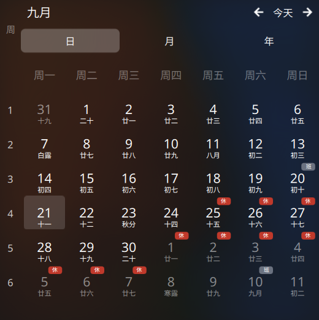

# 农历月历 · Lunar Calendar (KDE Plasma 6)

一个常驻桌面的月历小组件，通过 KDE 官方的 `alternatecalendar` 日历引擎显示中国农历，
并可选显示**自定义「学期周数」**（以开学日为第 1 周）。



> **English:** A desktop calendar plasmoid for KDE Plasma 6 that displays the Chinese lunar
> calendar (农历), plus an optional custom term/semester week-number column (e.g. "week 1 =
> the week the school term starts"). It reuses KDE's own `alternatecalendar` calendar plugin
> engine — the same engine behind the Digital Clock's calendar popup — so the lunar data is
> not reimplemented here, and it shares the calendar-system setting with the system tray clock.

## 特性

- 常驻桌面的月历，每个日期下方显示农历（初一、十五……）与节气（白露、秋分、寒露……）
- 农历数据来自 KDE 官方引擎（`plasma-calendar-addons` 提供的 `alternatecalendar` 插件），
  与系统托盘时钟共享同一份配置 —— **不是自己算的**
- **可选的自定义学期周数列**：以指定的开学日为第 1 周，按周递增（详见下节）
- **可选的法定节假日标记**：在日期上标出 `休`（放假）与 `班`（调休上班），
  数据取自国务院办公厅逐年发布的放假安排通知（详见下节）
- 自动刷新：跨天更新「今天」高亮，跨月自动回到当前月
- 纯 QML，无需编译；约 4 MB 内存

## 为什么需要它

在 Plasma 6 里，农历是由**日历事件插件**渲染的：

| 组件 | 农历支持 |
| --- | --- |
| 数字时钟（系统托盘）的弹窗 | ✅ 有 —— 在「配置 → 日历 → 可用插件」里勾选 `alternatecalendar` |
| **独立的「日历」桌面组件** | ❌ 无 —— 它的配置项只有工作时间/周数/紧凑显示，QML 中也不加载日历插件 |
| 本组件 | ✅ 直接复用官方引擎 |

KDE 有一个 2020 年就提出的 feature request（为主日历组件加备用历法支持），至今未合入。

## 安装

```bash
git clone https://github.com/helloydh007/plasma-lunar-calendar.git
cd plasma-lunar-calendar
./install.sh
```

然后：**桌面右键 → 添加小组件 → 搜索「农历」→ 拖到桌面**。
首次拖入时建议放大到内容区高度 ≥ 400px（见下方「实现要点」第 4 条）。

手动安装等价于：

```bash
kpackagetool6 --type Plasma/Applet --install .
```

卸载：

```bash
kpackagetool6 --type Plasma/Applet --remove io.github.helloydh007.lunarcalendar
```

## 学期周数（自定义周数）

月历左侧可以显示一列自定义周数，用于「开学那一周算第 1 周」这类需求。

**配置方式**：在组件上点右键 → 「配置农历月历…」→

- 勾选「在月历左侧显示周数」
- 填入「第 1 周起始日」，格式 `yyyy-MM-dd`，例如 `2026-09-01`
- 旁边有「今天 / 本周首日 / 本月 1 日」三个快捷按钮，下方会实时预览「今天属于第几周」

**规则**：

- 起始日只要落在第 1 周内的任意一天即可 —— 程序会自动折到该周的首日。
  所以填「开学日 9 月 1 日（周二）」与填「8 月 31 日（周一）」结果完全相同。
- 每周的首日按系统区域设置（`zh_CN` 为周一）。
- **早于第 1 周的日期不显示数字**（留空），不会出现负数。
- 周次会一直递增，跨月、跨年都正确。

以起始日 `2026-09-01` 为例，九月的六行显示 `1 2 3 4 5 6`；把起始日改到 `2026-09-28`
后，只有最后两行显示 `1 2`，前四行留空。

## 法定节假日标记

默认开启。在日期格子右上角显示小标记：

- **`休`**（红）—— 法定放假日
- **`班`**（灰）—— 调休上班日（周末补班）

悬停任意标记可看节日名（如「中秋节：放假」「国庆节：调休上班」）。在配置页可以关闭。

### 为什么用内置数据表而不是推算

节日的**日期**确实可以算（春节＝正月初一、清明＝清明节气、中秋＝八月十五……），但
**「放假安排」算不出来**：哪几天连休、哪个周末要补班，是国务院办公厅每年单独发文规定的
行政安排，逐年不同 —— 例如同样是春节，2025 与 2026 的调休日完全不同。任何声称能"推算"
调休的做法都是错的。

所以本组件内置数据表，来源为国务院办公厅通知：

| 年份 | 文号 | 发布 |
| --- | --- | --- |
| 2025 | 国办发明电〔2024〕7 号 | 2024-11-12 |
| 2026 | 国办发明电〔2025〕7 号 | 2025-11-04 |

数据在收录时逐条做过「通知里标注的星期几 vs 程序计算」交叉校验（100% 吻合），
这能有效发现抄录错误 —— 日期写错时星期几乎必然对不上。

### 如何补充下一年

次年安排通常在上一年 11 月前后发布。发布后编辑 `contents/ui/holidays.js`：

1. 在 `OFF`（放假）与 `WORK`（调休上班）中按 `"yyyy-MM-dd": "节日名"` 追加条目
2. 用通知里写的星期几核对一遍日期
3. 更新 `COVERED_YEARS`

**未覆盖的年份不会显示任何标记**（宁可什么都不显示，也不显示错误信息）。
配置页会显示当前数据覆盖的年份范围。

## 依赖

- KDE Plasma **6.0+**（`X-Plasma-API-Minimum-Version: 6.0`）
- `plasma-workspace` —— 提供 `org.kde.plasma.workspace.calendar`（`MonthView` 组件）
- `plasma-calendar-addons` —— 提供 `alternatecalendar` 农历插件

Debian / Ubuntu：

```bash
sudo apt install plasma-workspace plasma-calendar-addons
```

## 实现要点（踩过的坑）

如果你想基于 `MonthView` 写自己的组件，这五条能省你几个小时。

### 1. `main.qml` 的根元素必须是 `PlasmoidItem`

libPlasmaQuick 里有硬性检查：

```text
The root item of %1 must be of type PlasmoidItem
```

用普通 `Item` 作根，plasmashell 会**拒绝加载并静默移除组件**（只有在手动从组件面板添加时
才会弹出一个报错框）。调试时如果只看日志，容易误判成别的问题。

### 2. 驱动「显示哪个月」的是 `today:`，不是 `currentDate:`

```qml
PlasmaCalendar.MonthView {
    today: root.today      // ✅ 显示月份的驱动入口
    // currentDate: ...    // ❌ 这是「被选中的日期」，由组件内部在用户点击某天时赋值
}
```

传错属性会让日历后端停在未初始化的 `0` 年，整月显示成 `-5 -4 -3 … 36` 这种负数日期。
数字时钟传的就是 `today`。

### 3. `today` 必须是「活」的

```qml
property date today: new Date()      // ❌ 只在组件创建时求值一次
```

QML 里裸的 `new Date()` 不会自己前进。组件长期不重建（plasmashell 连续运行数天/数周）后，
「今天」高亮会停在组件创建那天，跨月后显示的仍是上个月。

官方组件的做法是把它绑在时钟数据源上：

```qml
P5Support.DataSource {
    interval: 60000
    intervalAlignment: P5Support.Types.AlignToMinute
}
MonthView { today: dataSource.data["Local"]["DateTime"] }
```

本组件用相同周期（60 秒）的 `Timer` 达到同样效果，并且额外做了**跨月重建**：日历后端的
`today` 与 `displayedDate` 是**相互独立**的两个属性，`today` 前进不会带着显示月份走，而
`MonthView` 没有公开的「跳转到某月」接口（`selectedMonth` / `selectedYear` 都是只读别名，
`resetToToday` 是内部实现），因此跨月时重建一次表示层让日历回到当前月。

### 4. 内容区高度 ≥ 400px

每个日期格子要放下两层文字（公历数字 + 农历），高度不足时两层会叠印在一起。

### 5. 自定义周数列怎么对齐到日历行

`MonthView` 内建的周数列只支持 ISO 周数（数据来自后端 `weeksModel`），**无法注入自定义
编号**，所以本组件的周数列是自己画在左边的。对齐靠 `MonthView` 暴露的几何参数：

```qml
anchors.topMargin: monthView.viewHeader.height + monthView.cellHeight + 2 * monthView.borderWidth
spacing: monthView.borderWidth          // 每项高度 = monthView.cellHeight
```

行起始日直接从 `monthView.daysModel` 读取（索引 `0,7,14,21,28,35` 即每行首日，角色为
`yearNumber` / `monthNumber` / `dayNumber`），不做任何推算 —— 因此与「月首是周几」「用哪套
历法」都无关。

**不要把这些值硬编码**：它们随字体、面板缩放、组件尺寸变化，硬编码会在别的机器上错位。

### 6. 节假日标记：往官方网格上叠一层

同样因为官方网格的文字无法注入，`休`/`班` 标记是叠在上面的独立一层，靠同一套几何公式
定位到每个格子的右上角：

```qml
readonly property int cw: Math.floor((monthView.width - (cols + 1) * bw) / cols)
readonly property int gridTop: monthView.viewHeader.height + ch + 2 * bw
x: bw + (列号) * (cw + bw) + cw - 标记宽 - 1
y: gridTop + (行号) * (ch + bw) + 1
```

格子的日期由「行首日期 + 列偏移天数」得到 —— `Date` 会自动处理跨月进位，所以不需要关心
月首落在周几。

标记的点击区域特意做成**整格大小**而标记本身只占右上角：这样悬停格子任意位置都能看到节日
提示。未命中节假日的格子 `visible: false`，完全不拦截鼠标事件，不会影响日历本身的交互。

## 已知限制

- 只在**中国农历**下做了验证。引擎本身也支持希伯来历、伊斯兰历等，改系统托盘时钟的
  日历设置即可共享同一份配置。
- 学期周数只支持一组自定义起点；不能同时显示 ISO 周数与自定义周数。
- **节假日数据是内置表，只覆盖已收录的年份**（见上节）。未覆盖年份不显示标记；次年安排
  发布后需更新 `holidays.js`。
- 跨月时如果你正翻看其它月份，视图会回到当前月（每月最多一次）。
- 添加/删除桌面组件后 Plasma 可能重新排布桌面并改变本组件尺寸；若被压得过矮，农历文字
  会与公历数字叠印，拖一下边角放大即可。

## 许可

GPL-2.0-or-later —— 与它所复用的 KDE 组件保持一致。
