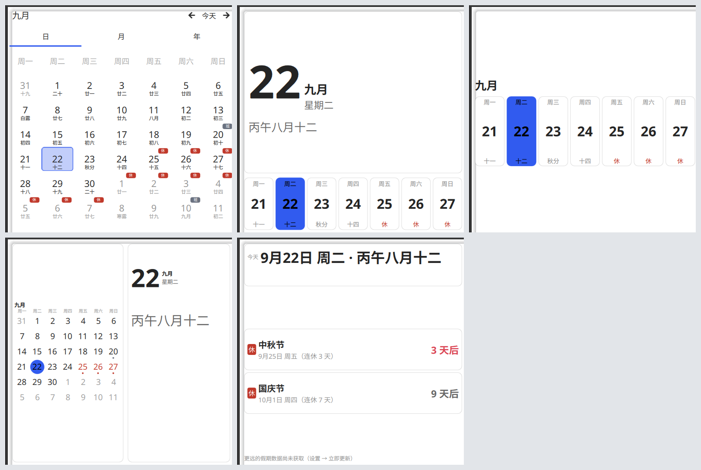

# 农历月历 · Lunar Calendar (KDE Plasma 6)

一个常驻桌面的月历小组件，通过 KDE 官方的 `alternatecalendar` 日历引擎显示中国农历，
有**七种显示样式**可切换（含自定义目标的**倒计时卡片**），可放桌面也可放面板，并可选显示**自定义「学期周数」**（以开学日为第 1 周）。


> **English:** A desktop calendar plasmoid for KDE Plasma 6 that displays the Chinese lunar
> calendar (农历). Seven interchangeable display styles (full month grid / today card / week
> strip / mini month + today / holiday countdown / lunar almanac / custom countdown cards),
> a one-line compact view for panels, an optional custom term/semester week-number column,
> statutory-holiday markers (休 / 班), and adjustable background and card opacity. It reuses KDE's own
> `alternatecalendar` calendar plugin engine — the same engine behind the Digital Clock's
> calendar popup — so the lunar data is not reimplemented here, and it shares the
> calendar-system setting with the system tray clock.

## 特性

- 常驻桌面的月历，每个日期下方显示农历（初一、十五……）与节气（白露、秋分、寒露……）
- 农历数据来自 KDE 官方引擎（`plasma-calendar-addons` 提供的 `alternatecalendar` 插件），
  与系统托盘时钟共享同一份配置 —— **不是自己算的**
- **七种显示样式**，设置里切换，尺寸都自适应（详见下节）：
  | 样式 | 看什么 |
  | --- | --- |
  | 整月网格（默认） | 一眼看全一个月 |
  | 今日 | 今天是什么日子（大字号 + 本周一条） |
  | 本周 | 只画本周七天，占地最小 |
  | 迷你月历 + 今日 | 小月历 + 今天详情，约半格面积 |
  | 假期倒计时 | 接下来的法定节假日与「几天后」 |
  | 农历详情 | 干支纪年与生肖、下个节气/农历节日还有几天 |
  | 倒计时 | 自己定的目标卡片：「距离考研 88 天」或「开学第 22 天」 |
- **也能放任务栏**：拖到面板里自动变成一行紧凑视图（`22 八月十二`），点一下展开完整视图
- **背景与卡片不透明度可调**（0–100%），可以把底板调透、只留内容浮在桌面上
- **可选的自定义学期周数列**：以指定的开学日为第 1 周，按周递增（详见下节）
- **可选的法定节假日标记**：在日期上标出 `休`（放假）与 `班`（调休上班），
  数据取自国务院办公厅逐年发布的放假安排通知（详见下节）
- 自动刷新：跨天更新「今天」高亮，跨月自动回到当前月
- 纯 QML，无需编译；约 4 MB 内存

## 为什么需要它

在 Plasma 6 里，农历是由**日历事件插件**渲染的：

| 组件 | 农历支持 |
| --- | --- |
| 数字时钟（系统托盘）的弹窗 | ✅ 有 —— 在「配置 → 日历 → 可用插件」里勾选 `alternatecalendar` |
| **独立的「日历」桌面组件** | ❌ 无 —— 它的配置项只有工作时间/周数/紧凑显示，QML 中也不加载日历插件 |
| 本组件 | ✅ 直接复用官方引擎 |

KDE 有一个 2020 年就提出的 feature request（为主日历组件加备用历法支持），至今未合入。

## 安装

```bash
git clone https://github.com/helloydh007/plasma-lunar-calendar.git
cd plasma-lunar-calendar
./install.sh
```

然后：**桌面右键 → 添加小组件 → 搜索「农历」→ 拖到桌面**。
首次拖入时建议放大到内容区高度 ≥ 400px（见下方「实现要点」第 4 条）。

手动安装等价于：

```bash
kpackagetool6 --type Plasma/Applet --install .
```

卸载：

```bash
kpackagetool6 --type Plasma/Applet --remove io.github.helloydh007.lunarcalendar
```

## 显示样式（七种）

在组件上点右键 → 「配置农历月历…」→ **外观** → 「显示样式」，随时切换。



左上起：整月网格 · 今日 · 本周 ／ 迷你月历 + 今日 · 假期倒计时 · 农历详情 ／ 倒计时
（都是 416 × 417 逻辑像素下的实际渲染；图中是浅色主题，实际跟随你的颜色方案）

| 值 | 名字 | 画什么 | 适合 |
| --- | --- | --- | --- |
| `month` | 整月网格 | 一个月一张网格，格子里公历日号 + 农历（或节气），右上角 `休`/`班` | 一眼看全一个月 |
| `today` | 今日 | 大字号日号 + 月/星期 + 农历整句 + 学期周次 + `休`/`班` 徽章，下方一条本周七天 | 桌面一瞥就够 |
| `week` | 本周 | 一行标题（`九月 · 第 3 周`）+ 本周七天，每格星期/日号/农历 | 占地最小，适合很扁的尺寸 |
| `mini` | 迷你月历 + 今日 | 左边小月历（只有日号，今天高亮，节假日一个色点）+ 右边今天详情 | 面积约为整月网格的一半 |
| `upcoming` | 假期倒计时 | 接下来的法定节假日列表：节日名 / 日期 / `3 天后`，还有今天的摘要 | 回答「最近的假是哪天」 |
| `almanac` | 农历详情 | 干支纪年与生肖（`丙午年 · 马`）+ 农历月日作主角 + 下个节气还有几天 + 下一个农历节日 + 本月两个节气 | 回答「今天是什么农历日子」 |
| `countdown` | 倒计时 | 自己定的目标：第 1 条大卡，其余小行；支持「距离 xxx 还有 N 天」与「xxx 第 N 天」两种数法 | 考试、纪念日、项目截止 |

「农历详情」里的农历节日是从农历日期认出来的（`八月十五` → 中秋节），所以它能认出**非法定**
的节日（七夕、重阳、腊八、小年、龙抬头）。往后找的范围是**当前月 + 之后 84 天**；窗口里
没有节日时，那一行会自动退成「下个假期」（法定节假日），不会留个空位让人以为坏了。

设计上的几条硬规矩：

- **今天永远一眼可辨** —— 每种样式里今天都是实心高亮，且不受「卡片不透明度」影响
- **`休` / `班` 徽章不受透明度影响** —— 那是信息，跟着淡就会糊在壁纸上读不清
- 文字放不下就省略，不叠印；列表放不下就少显示几行，并在下面说明还有几个没显示
- 高度不够时按「先舍弃次要信息」的顺序让步（例如农历详情会先去「本月节气」、再去倒计时块）
- 除「倒计时」外，其余样式共用同一份日期数据（见「实现要点」第 7 条），换样式不会改变农历的准确性

**「法定节假日」与「学期周数」两个开关对所有样式生效**：格子上的标记、卡片上的 `休`/`班`
徽章、本周条里的「休」、各样式里的「第 N 周」都跟着开或关。唯一的例外是「假期倒计时」——
它整块就是假期内容，不看节假日开关。

## 倒计时目标（自定义倒计时卡片）

「倒计时」样式显示的是**你自己定的日期**，和农历/节假日无关：

- **倒计时**：填一个将来的日子，显示「距离 考研 88 天」；过了那天变成灰字的「已过 N 天」，
  当天显示「就是今天」
- **正向**：从某天数起，那天算第 1 天 —— 「开学 第 22 天」「在一起 第 100 天」；
  日子还没到时灰字显示「还有 N 天（尚未开始）」

**配置方式**：右键组件 →「配置农历月历…」→ **倒计时** → 「添加一条」：

- 名称 + 日期（`yyyy-MM-dd`，无效日期会标红并提示）
- 每行右侧实时预览「还有 N 天 / 第 N 天」，改完点「应用」
- 没填完的行不会保存；删除也在这一页

显示条数随组件高度自适应：放不下时少显示几行，底部注明「还有 N 个目标未显示」。
第 1 条目标是大卡，其余排成小行（想突出哪个就把拖到第一位）。

## 放在面板（任务栏）里

把组件拖到任务栏，它会自动换成一行紧凑视图：

```
┌──────────────┐
│ 22  八月十二 │   ← 今天放假/调休时右边多一个 休 / 班 徽章
└──────────────┘
```

- 悬停显示完整提示：`2026年9月22日 星期二` / `丙午八月十二 · 第 3 周 · 中秋节：放假`
- 点一下展开完整视图 —— 桌面上那七种样式在弹窗里照常可用
- 紧凑视图**不受「显示样式」影响**：面板上位置太窄，只有这一行是合适的
- 桌面上的实例不受影响：Plasma 按组件所在位置（桌面 / 面板）自动选表示层

## 背景与卡片不透明度

「外观」页有两个滑杆，都是 0–100%：

- **背景不透明度** —— 组件底板。调到 0 就只剩内容浮在桌面上，完全没有背景板。
- **卡片不透明度** —— 卡片底色（今日卡、本周条、假期行等）。调到 0 就只剩文字与细描边。
  整月网格不受影响 —— 那里的格子是日历本身，没有卡片。

两者相互独立：可以把底板留实、卡片调透，也可以反过来。

**背景由组件自己绘制**（用桌面主题的 `widgets/background` 边框，所以外观和容器画的一致），
这样数值才是准的。代价是**组件右键菜单里 Plasma 那个「背景」开关不再起作用** —— 配置页里
有等效且更细的控制。

## 学期周数（自定义周数）

月历左侧可以显示一列自定义周数，用于「开学那一周算第 1 周」这类需求。

**配置方式**：在组件上点右键 → 「配置农历月历…」→

- 勾选「在月历左侧显示周数」
- 填入「第 1 周起始日」，格式 `yyyy-MM-dd`，例如 `2026-09-01`
- 旁边有「今天 / 本周首日 / 本月 1 日」三个快捷按钮，下方会实时预览「今天属于第几周」

**规则**：

- 起始日只要落在第 1 周内的任意一天即可 —— 程序会自动折到该周的首日。
  所以填「开学日 9 月 1 日（周二）」与填「8 月 31 日（周一）」结果完全相同。
- 每周的首日按系统区域设置（`zh_CN` 为周一）。
- **早于第 1 周的日期不显示数字**（留空），不会出现负数。
- 周次会一直递增，跨月、跨年都正确。

以起始日 `2026-09-01` 为例，九月的六行显示 `1 2 3 4 5 6`；把起始日改到 `2026-09-28`
后，只有最后两行显示 `1 2`，前四行留空。

## 法定节假日标记

默认开启。在日期格子右上角显示小标记：

- **`休`**（红）—— 法定放假日
- **`班`**（灰）—— 调休上班日（周末补班）

悬停任意标记可看节日名（如「中秋节：放假」「国庆节：调休上班」）。在配置页可以关闭，
也可以在那里更新数据（见下节「更新方式一」）。

### 为什么用内置数据表而不是推算

节日的**日期**确实可以算（春节＝正月初一、清明＝清明节气、中秋＝八月十五……），但
**「放假安排」算不出来**：哪几天连休、哪个周末要补班，是国务院办公厅每年单独发文规定的
行政安排，逐年不同 —— 例如同样是春节，2025 与 2026 的调休日完全不同。任何声称能"推算"
调休的做法都是错的。

所以本组件内置数据表，来源为国务院办公厅通知：

| 年份 | 文号 | 发布 |
| --- | --- | --- |
| 2025 | 国办发明电〔2024〕7 号 | 2024-11-12 |
| 2026 | 国办发明电〔2025〕7 号 | 2025-11-04 |

数据在收录时逐条做过「通知里标注的星期几 vs 程序计算」交叉校验（100% 吻合），
这能有效发现抄录错误 —— 日期写错时星期几乎必然对不上。

### 更新方式一：在配置页点按钮（运行时联网，默认手动）

在组件上右键 →「配置农历月历…」：

- **数据更新方式**：`手动（默认）` / `自动（每 30 天检查一次）`
- **节假日数据**：`立即更新` 按钮 + 当前覆盖情况

点「立即更新」后，组件会依次尝试两个数据源、把通过校验的数据存入自身配置缓存
（只保存内置数据未覆盖的年份），并提示你点「应用」保存。**默认不联网**——只有你点按钮
（或把方式改为自动）时才会发起请求。

**它会去取哪些年份？** 从「最新已覆盖年份 + 1」一直排到「次年」，因此**中途遗漏的
年份会被自动补回来**。也就是说：

| 时点 | 会尝试获取 | 结果 |
| --- | --- | --- |
| 2026 年 9 月 | 2027 | 尚未发布 → 中性提示「尚未发布」 |
| 2026 年 11 月起 | 2027 | 通知发布后取到，写入缓存 |
| 2027 年 1 月 | 2028 | 尚未发布 → 中性提示 |
| **2027 年整年没点，2028 年 1 月才点** | **2027**、2028、2029 | 2027 被补回并写入缓存；后两年中性提示 |

因此不需要你在 11 月特意想起来去点——只要那时点一次（或开着自动模式），次年数据就会到手；
**即使整整一年没更新，下次点击也会自动补回遗漏的年份**。

单次更新最多联网获取 5 个年份（防止内置数据极旧、积欠多年时一次发起几十个请求）；
若还有年份待取，结果里会提示再点一次继续。

**顺序上「当年与次年」永远优先，空档排在后面。** 这是刻意设计：某些年份的数据源可能
本来就取不到（补不回来），若空档排前面，它们会一直占着每次的配额，把当年最要紧的数据
挤掉。补不回来的空档会提示「数据源中不存在，已跳过（不影响其它年份）」，不会反复报错。

### 本机时间不准会怎样

判断「该取哪些年份」用的是**网络时间，不是本机时钟**：

- 每次联网都会从响应的 `Date` 头取回服务端时间（该头是 CORS 安全头，跨域也可读），
  存入缓存；**即使请求失败（404 等）也能取到**
- 之后所有年份判断与自动检查节律都以这个时间为准，因此**把系统时间改到 2030 年或
  2020 年都不会导致追未来年份或停止更新**
- 只有在「从未成功联网过」的那一次才会退回使用本机时钟；此时即使时间不准也只会
  多试几个取不到的年份（有 5 个/次的上限保护），不影响已有数据
- 偏差明显时（≥2 天）会在结果里提示一句，例如
  「本机时间与网络时间相差约 480 天，年份判断已改用网络时间」

**「尚未发布」与「更新失败」是区分开的**：前者是预期内的正常状态（用中性色提示，并说明
通常在上一年 11 月上旬公布，**HTTP 404 也归入此类**——远期年份的数据源文件尚不存在）；
只有网络故障、其它 HTTP 错误、数据未通过校验才算失败（标红）。

### 更新方式二：命令行工具（完全离线）

```bash
python3 tools/update-from-web.py 2027 --write
```

拉取 → 结构校验 → 自检 → 与已有数据比对列差异 → 打印对照表 → 写入内置数据表 →
自动复核。适合批量更新或想在提交前审阅数据的情况。

### 两种方式的共同点：数据必须过校验

无论哪条路径，拉取到的数据都要先通过这些检查才会被采用（`holidays-update.js`
里的 `validatePayload`，与 Python 版同源）：

- 放假与补班不重叠
- 补班日必须落在周末（调休补班在实践中都是周末）
- 每个节日的放假是**一整段连续日期**（写错月/日几乎必然造成断档）
- 落在天文/政策窗口内（春节必在 1/21–2/21、清明必在 4/4–4/6、元旦必含 1/1、国庆必含 10/1）
- 各节日天数与年度总天数在合理区间

**任一检查不过就丢弃该数据、尝试下一个源**；全部失败则维持原有数据不变。
宁可什么都不显示，也不显示错误的节假日。

### 数据源与「怎么知道哪天调休」

放假安排**无法由历法推算**——哪几天连休、哪个周末补班，是国务院办公厅每年单独发文
规定的行政安排，逐年不同（同样是春节，2025 与 2026 的调休日完全不同）。因此只能取现成数据。

- **发布时间**：通常在上一年 **11 月上旬**（2025 年安排发布于 2024-11-12；
  2026 年安排发布于 2025-11-04）
- **数据源**：[holiday-cn](https://github.com/NateScarlet/holiday-cn)，社区维护、覆盖
  2007–2026，每条数据都标注对应的政府网通知原文 URL（组件会把该链接记进缓存）
- **备用源**：同一份数据经 jsDelivr CDN，在直连 GitHub 受限的网络下通常仍可用
- **未发布年份**：数据源对其只有占位文件，组件会识别并明确告知「尚未发布」，不会写入任何东西

### 关于联网的取舍（如实说明）

本组件**默认不联网**，但提供可选的联网更新，因为两种需求都真实存在：

- 想要省事：点一次按钮（或设为自动），次年数据自动到手
- 想要完全离线：用命令行工具，或干脆不更新——内置数据表本身就是可用兜底，
  **断网、代理异常、接口失效都不影响已覆盖年份的显示**

需要知道的代价：

- 点按钮 / 自动模式下，组件会访问 `raw.githubusercontent.com` 与 `cdn.jsdelivr.net`；
  自动模式每 30 天最多一次，且只取「内置与缓存都没有的年份」
- 社区接口的可用性无法保证（例如常被引用的 timor.tech 现已被 Cloudflare 拦截返回 403），
  因此内置了双源回退与严格校验，并且任何失败都不会破坏已有数据

## 依赖

- KDE Plasma **6.0+**（`X-Plasma-API-Minimum-Version: 6.0`）
- `plasma-workspace` —— 提供 `org.kde.plasma.workspace.calendar`（`MonthView` 组件）
- `plasma-calendar-addons` —— 提供 `alternatecalendar` 农历插件

Debian / Ubuntu：

```bash
sudo apt install plasma-workspace plasma-calendar-addons
```

## 实现要点（踩过的坑）

如果你想基于 `MonthView` 写自己的组件，这几条能省你几个小时。

### 1. `main.qml` 的根元素必须是 `PlasmoidItem`

libPlasmaQuick 里有硬性检查：

```text
The root item of %1 must be of type PlasmoidItem
```

用普通 `Item` 作根，plasmashell 会**拒绝加载并静默移除组件**（只有在手动从组件面板添加时
才会弹出一个报错框）。调试时如果只看日志，容易误判成别的问题。

### 2. 驱动「显示哪个月」的是 `today:`，不是 `currentDate:`

```qml
PlasmaCalendar.MonthView {
    today: root.today      // ✅ 显示月份的驱动入口
    // currentDate: ...    // ❌ 这是「被选中的日期」，由组件内部在用户点击某天时赋值
}
```

传错属性会让日历后端停在未初始化的 `0` 年，整月显示成 `-5 -4 -3 … 36` 这种负数日期。
数字时钟传的就是 `today`。

### 3. `today` 必须是「活」的

```qml
property date today: new Date()      // ❌ 只在组件创建时求值一次
```

QML 里裸的 `new Date()` 不会自己前进。组件长期不重建（plasmashell 连续运行数天/数周）后，
「今天」高亮会停在组件创建那天，跨月后显示的仍是上个月。

官方组件的做法是把它绑在时钟数据源上：

```qml
P5Support.DataSource {
    interval: 60000
    intervalAlignment: P5Support.Types.AlignToMinute
}
MonthView { today: dataSource.data["Local"]["DateTime"] }
```

本组件用相同周期（60 秒）的 `Timer` 达到同样效果，并且额外做了**跨月重建**：日历后端的
`today` 与 `displayedDate` 是**相互独立**的两个属性，`today` 前进不会带着显示月份走，而
`MonthView` 没有公开的「跳转到某月」接口（`selectedMonth` / `selectedYear` 都是只读别名，
`resetToToday` 是内部实现），因此跨月时重建一次表示层让日历回到当前月。

### 4. 内容区高度 ≥ 400px

每个日期格子要放下两层文字（公历数字 + 农历），高度不足时两层会叠印在一起。

### 5. 自定义周数列怎么对齐到日历行

`MonthView` 内建的周数列只支持 ISO 周数（数据来自后端 `weeksModel`），**无法注入自定义
编号**，所以本组件的周数列是自己画在左边的。对齐靠 `MonthView` 暴露的几何参数：

```qml
anchors.topMargin: monthView.viewHeader.height + monthView.cellHeight + 2 * monthView.borderWidth
spacing: monthView.borderWidth          // 每项高度 = monthView.cellHeight
```

行起始日取自 `main.qml` 传入的 `cells`（见第 7 条，每行首日即索引 `0,7,14,21,28,35`），
不做任何推算 —— 因此与「月首是周几」「用哪套历法」都无关。

**不要把这些值硬编码**：它们随字体、面板缩放、组件尺寸变化，硬编码会在别的机器上错位。

### 6. 节假日标记：往官方网格上叠一层

同样因为官方网格的文字无法注入，`休`/`班` 标记是叠在上面的独立一层，靠同一套几何公式
定位到每个格子的右上角：

```qml
readonly property int cw: Math.floor((monthView.width - (cols + 1) * bw) / cols)
readonly property int gridTop: monthView.viewHeader.height + ch + 2 * bw
x: bw + (列号) * (cw + bw) + cw - 标记宽 - 1
y: gridTop + (行号) * (ch + bw) + 1
```

（格子的日期直接取 `cells[行号 * 7 + 列号]`，不再从 `daysModel` 里读。）

标记的点击区域特意做成**整格大小**而标记本身只占右上角：这样悬停格子任意位置都能看到节日
提示。未命中节假日的格子 `visible: false`，完全不拦截鼠标事件，不会影响日历本身的交互。

### 7. 不实例化 `MonthView` 也能拿到农历：自己建一个 `Calendar`

`org.kde.plasma.workspace.calendar` 里的 `Calendar` 是可以直接创建的，它自带
`daysModel`；把 `EventPluginsManager` 交给它，就能拿到那 42 个格子的农历/节气：

```qml
PlasmaCalendar.EventPluginsManager {
    id: eventPluginsManager
    enabledPlugins: ["alternatecalendar"]
}

PlasmaCalendar.Calendar {
    id: lunarBackend
    days: 7
    weeks: 6
    firstDayOfWeek: Qt.locale().firstDayOfWeek
    today: root.today
    displayedDate: root.today        // 决定这 42 天从哪天起算；跨月时它跟着走
    Component.onCompleted: daysModel.setPluginsManager(eventPluginsManager)
}

// 42 个 0 尺寸的 delegate 把角色读出来发布给全组件
Repeater {
    model: lunarBackend.daysModel
    delegate: Item {
        required property int index
        required property var model
        // dayLabel = 公历日号；subDayLabel = 农历短标签（「十二」，初一那天是月名
        // 「八月」，节气当天是节气名「白露」）；subLabel = 完整写法「丙午八月十二」，
        // 节气当天带括号「丙午七月廿六 (白露)」——括号是判断节气的可靠信号
    }
}
```

两个必须知道的点：

- **农历数据是异步到的**（实测创建后 1–3 秒）。必须在绑定里读，绝不能在
  `Component.onCompleted` 里快照 —— 那样只会拿到空字符串。
- **要用 `displayedDate` 换月**，不是 `today`。二者独立：`today` 只管高亮判定。

窗口开成 `weeks: 12`（84 天）：前 42 天就是月历网格那 6 行（月历网格与迷你月历只取前 42 格），
多出来的部分给「农历详情」往后找节气/农历节日。这样各农历样式共用同一份 `cells`，换样式不重建
日历后端，也没有「换月时读到上个月」的陈旧数据问题（原来的做法是从月历视图内部的
`daysModel` 读，一旦那个视图没被实例化就没数据）。

### 8. Layout 会饿死 implicitHeight 为 0 的项

这是个很难从现象反推的坑。下面的卡片内容全是 `anchors.fill` 的子项 —— 而**锚定子项不参与
父项的 implicit 尺寸计算**，于是卡片的 `implicitHeight` 是 `0`：

```qml
ColumnLayout {
    Rectangle {                      // 卡片
        Layout.fillHeight: true
        ColumnLayout { anchors.fill: parent; /* … */ }   // ← 不贡献 implicit 高度
    }
    RowLayout { Layout.preferredHeight: Math.round(height * 0.26) }   // 本周条
}
```

实测（探针打印生效后的值）：容器高 1039 时，**卡片拿到 3px，本周条拿到 1000px** ——
和直觉相反。所以本组件的五个样式**外层几何全部自己算** `x/y/width/height`（尺寸由
组件尺寸自上而下推出，不再回流），只在尺寸已经定死的容器内部才用 `Layout`。

顺带一条：Positioner（`Row`/`Column`）的子项**不要挂锚**，`Row` 只管 `x`，纵向位置自己写
`y`。

### 9. 别用 `Qt.formatDate(d, "ddd")` 取星期名

它跟随进程 locale，实测在英文 locale 下给出 `Fri`，而同一进程里 `Qt.locale().dayName()`
给的是 `周五`。两者不一致，组件里统一写成：

```qml
Qt.formatDate(d, "M月d日") + " " + Qt.locale().dayName(d.getDay(), Locale.ShortFormat)
```

### 10. 提示文字写在 `PlasmoidItem` 上，**不要**加 `Plasmoid.` 前缀

```qml
toolTipMainText: "…"        // ✅ PlasmoidItem 自己的属性
toolTipSubText: "…"
// Plasmoid.toolTipMainText: "…"   ❌ non-existent property（附加对象上那两个只读）
```

附加对象 `Plasmoid` 上有同名的**只读**转发（系统组件的 `Accessible.name: Plasmoid.toolTipMainText`
就是在读它），所以「读得到」这件事很容易让人以为「写得进去」—— 赋值会让整个组件加载失败，
报 `Cannot assign to non-existent property "toolTipSubText"`。

顺带两条面板相关的：紧凑视图的尺寸要写 `Layout.minimumWidth` / `Layout.preferredWidth` /
`Layout.maximumWidth`（只写 `implicit*` 面板会当成默认小方块）；点击展开用
`root.expanded = !root.expanded`（`PlasmoidItem` 的属性，官方日历组件也这么写）。

## 已知限制

- 只在**中国农历**下做了验证。引擎本身也支持希伯来历、伊斯兰历等，改系统托盘时钟的
  日历设置即可共享同一份配置。
- 学期周数只支持一组自定义起点；不能同时显示 ISO 周数与自定义周数，且只有「整月网格」
  样式里有那一列（另外四种样式在标题或卡片里显示「第 N 周」）。
- **节假日数据是内置表，只覆盖已收录的年份**（见上节）。未覆盖年份不显示标记；次年安排
  发布后需更新 `holidays.js`。假期倒计时样式在没有更远数据时会明确写出来，不会看着像
  「以后没有假了」。
- **背景由组件自己绘制**，所以右键菜单里 Plasma 那个「背景」开关不再起作用 ——
  用配置页的「背景不透明度」代替。
- 跨月时如果你正翻看其它月份，整月网格会回到当前月（每月最多一次）。
- 添加/删除桌面组件后 Plasma 可能重新排布桌面并改变本组件尺寸；若被压得过矮，农历文字
  会与公历数字叠印，拖一下边角放大即可。五种样式都有最小尺寸保护，缩到很小不会崩，
  但会按「先舍弃次要信息」的顺序让步。

## 许可

GPL-2.0-or-later —— 与它所复用的 KDE 组件保持一致。
